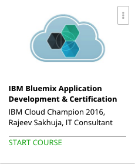

```
Roberto Nogueira  
BSd EE, MSd CE
Solution Integrator Experienced - Certified by Ericsson
```
# IBM Bluemix Application Development and Certification



**About This Course**

Write a live cloud application on Bluemix in 3 hours & get professional IBM cloud developer certification in 3 weeks.

## Topics
```
Section: 1
Introduction to the course
[x] 1. Introduction to the course 4:23
[x] 2. IBM Cloud Professional Certifications Overview 4:22
[x] 3. What you will need to complete this course 1:05
[x] 4. Please Read - Bluemix Portal look and feel 0:00

Section: 2
Introduction to IBM Cloud
[x] 5. Bluemix cloud offerings 10:23
[x] Quiz 1: Bluemix cloud offerings 0:00
[x] 6. Bluemix capabilities & deployment options 19:21
[x] Quiz 2: Bluemix capabilities & deployment options 0:00
[x] 7. Setting up account on IBM Bluemix account 4:35
[x] 8. Demo - Bluemix Trial setup and quick Portal walk through 5:39
[x] 9. Spaces, Domains, Users & Quota 11:59
[x] 10. Manage Account - Exercise 0:00
[x] 11. Manage Account - Exercise Solution 4:12
[x] Quiz 3: Organization, Spaces, Domains, Users, Quotas 0:00

Section: 3
Getting Ready for Cloud Development
[x] 12. Installing Eclipse IDE and Bluemix tools 0:00
[x] 13. Introduction Starters, Runtimes & Boilerplates 7:53
[x] Quiz 4: Starters, Boilerplate & Runtime 0:00
[x] 14. Using Runtime to create first application on Bluemix 14:05

Section: 4
Bluemix PaaS Architecture
[x] 15. Introduction to Cloud Foundry 14:43
[x] Quiz 5: Introduction to Cloud Foundry 0:00
[x] 16. Cloud Foundry Architecture 19:02
[x] Quiz 6: Cloud Foundry Architecture 0:00
[x] 17. Installation of the Cloud Foundry CLI 0:00
[x] 18. CLI Commands Overview, Login & Target 9:10
[x] 19. CLI Commands Domains, Spaces, Users 16:44
[x] 20. CLI Commands - Application Management & Development 19:29
[x] Quiz 7: Cloud Foundry Command Line Interface (CLI) 0:00
[x] 21. Cloud Foundry Environment Variables 15:33
[x] Quiz 8: Cloud foundry environment variables 0:00
[x] 22. Developing Bluemix no-route or Background application 6:06
[x] Quiz 9: Worker applications 0:00

Section: 5
Bluemix Managed Services
[x] 23. Bluemix Managed Services for Applications 17:24
[x] Quiz 10: Bluemix Managed Services 0:00
[x] 24. User provided services and VCAP_SERVICES 13:45
[x] Quiz 11: VCAP_SERVICES & User provided services 0:00

Section: 6
Factor Apps
[x] 25. Introduction to 12 factor App 7:02
[x] 26. Factors #1-4, Codebase, Dependencies, Configuration, Backing services 6:38
[x] Quiz 12: 12 factors app 0:00
[x] 27. Factors #5-8, Build & Run, Stateless Processes, Port Binding, Concurrency 8:35
[x] Quiz 13: 12 factors app (Factor# 5 to 8) 0:00
[x] 28. Factors #9-12, Disposability, Dev/Prod Parity, Logs, Admin Processes 7:24
[x] Quiz 14: 12 factors app (Factor# 9 to 12) 0:00

Section: 7
Developing and Managing applications on Bluemix PaaS
[x] 29. Bluemix Application Debugging 4:18
[x] 30. Application scaling on Bluemix PaaS 19:47
[ ] Quiz 15: Application debugging & Scaling 0:00
[ ] 31. Integrating with External Logging 10:28
[ ] 32. Application performance testing 16:03
[ ] 33. Load Impact Performance Testing Walkthrough 3:16
[ ] 34. Application Monitoring 19:38
[ ] Quiz 16: Logging, Testing and Monitoring 0:00

Section: 8
Bluemix Managed Services - Caching & Object Storage
[ ] 35. Bluemix Data & Session Caching Services 18:58
[ ] Quiz 17: Caching Services 0:00
[ ] 36. Services - Object Storage 15:42
[ ] Quiz 18: Object storage services 0:00

Section: 9
IBM Bluemix Message Hub Service
[ ] 37. Note: Message Hub 0:00
[ ] 38. Introduction to Kafka 8:53
[ ] 39. Message Hub - Kafka Topics and Partitions 16:57
[ ] Quiz 19: Message Hub Provisioning, Topics and Partitions 0:00
[ ] 40. Message Hub - Kafka Consumer Groups 13:23
[ ] Quiz 20: Consumer Groups 0:00
[ ] 41. Message Hub - Kafka Brokers and Clusters 4:17
[ ] 42. Message Hub client security and Producers 14:40
[ ] 43. Message Hub Consumers 18:58
[ ] Quiz 21: Message Hub Producers and Consumers 0:00
[ ] 44. Bluemix MQ Light Service 18:06
[ ] 45. MQ Light Application Walkthrough 17:20
[ ] Quiz 22: MQ Light Service 0:00

Section: 10
IBM Bluemix Alchemy API
[x] 46. Cognitive Capabilities - Alchemy API 2:51
[x] 47. Alchemy API - Language Processing 10:16
[x] 48. Alchemy API - Vision 5:27
[x] Quiz 23: Cognitive Services 0:00

Section: 11
Bluemix Managed Security Services
[ ] 49. Security services on Bluemix 10:08
[ ] 50. Demo SSO Service - Cloud Directory use from Bluemix Application 12:08
[ ] Quiz 24: Security Services 0:00

Section: 12
Data Services on Bluemix
[ ] 51. Data Services Types 10:33
[ ] Quiz 25: Database types 0:00
[ ] 52. Cloudant Features and DB instance creation 8:22
[ ] 53. Cloudant Queries, Indexes & Map Redues 14:23
[ ] Quiz 26: Cloudant Queries, Indexes & Map reduce 0:00
[ ] 54. Cloudant Insert, Update, Delete + Replication & Sync 14:15
[ ] Quiz 27: Cloudant Insert, Update, Delete & Replication, Sync 0:00
[ ] 55. DashDB Service Features and Walkthrough 12:55
[ ] Quiz 28: DashDB Quiz 0:00

Section: 13
IBM Bluemix DevOps
[ ] 56. IBM DevOps Capabilities 12:01
[ ] Quiz 29: IBM DevOps Capabilities 0:00
[ ] 57. Devops Web IDE 12:47
[ ] Quiz 30: IBM DevOps - Web IDE 0:00
[ ] 58. Devops Agile Planning & Tracking 19:57
[ ] Quiz 31: IBM DevOps - Tracking & Planning 0:00
[ ] 59. Devops Build and Deploy pipeline 18:23
[ ] Quiz 32: IBM DevOps - Build & Deploy 0:00

Section: 14
Docker and IBM Cloud containers
[ ] 60. Introduction to Docker 12:48
[ ] Quiz 33: Containers 0:00
[ ] 61. IBM Containers 7:30
[ ] Quiz 34: IBM Containers 0:00
[ ] 62. Local Image & Container creation (Walk through Part#1) 13:11
[ ] Quiz 35: Docker tools and Local image creation 0:00
[ ] 63. Container creation on IBM Bluemix (Walk through Part#2) 8:47
[ ] Quiz 36: Running containers on Bluemix 0:00

Section: 15
IBM Bluemix Virtual Machines
[ ] 64. Bluemix Virtual Machines, Images and Security groups 18:14
[ ] 65. Virtual Machine creation on Bluemix (walk through) 9:25
[ ] Quiz 37: Bluemix Virtual Machines 0:00

Section: 16
IBM Cloud Professional Certification Exam Prep Tests
[ ] Quiz 38: Certification Prep Test - 1 0:00
[ ] Quiz 39: Certification Prep Test - 2 0:00
[ ] Quiz 40: Certification Prep Test - 3 0:00
[ ] Quiz 41: Certification Prep Test - 4 0:00

Section: 17
Best of Luck
[ ] 66. Best of luck & Goodbye 1:27
```


